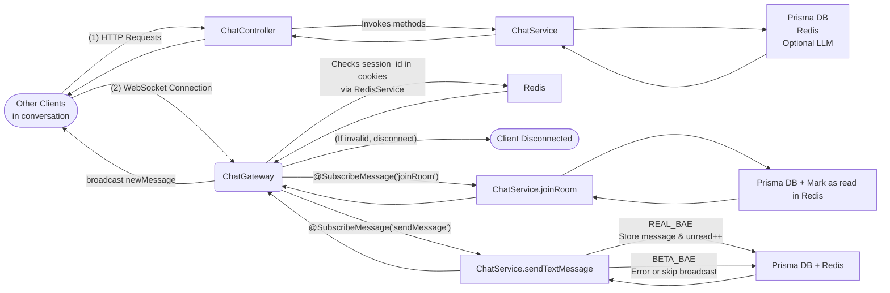

# BetaBae Backend

## Tech Stack

- **Framework**: [NestJS](https://nestjs.com/) (TypeScript)
- **Database**: MySQL with [Prisma ORM](https://www.prisma.io/)
- **Cache & Session**: [Redis](https://redis.io/) via [ioredis](https://github.com/redis/ioredis)
- **Storage**: AWS S3/MinIO for file storage
- **Authentication**: Custom cookie-based session management
- **Validation**: Class-validator for DTO validation
- **Containerization**: Docker & Docker Compose for development environment

## Project Structure

```
src/
├── app.module.ts              # Main application module
├── main.ts                    # Application entry point
├── dto/                       # Data Transfer Objects
│   ├── auth/                  # Authentication-related DTOs
│   ├── common/                # Shared DTOs
│   ├── file/                  # File-related DTOs
│   └── user/                  # User-related DTOs
├── enums/                     # Enum definitions
├── filters/                   # Exception filters
├── infra/                     # Infrastructure services
│   ├── prisma/                # Prisma ORM configuration and schema
│   ├── redis/                 # Redis configuration
│   └── s3/                    # S3/MinIO configuration
├── middleware/                # Application middleware
└── modules/                   # Feature modules
    ├── auth/                  # Authentication module
    ├── file/                  # File handling module
    └── user/                  # User management module
```

## Prerequisites

- Node.js (v18+)
- Docker and Docker Compose
- Yarn package manager

## Getting Started

### 1. Clone the Repository

```bash
git clone <repository-url>
cd betabae/app/backend
```

### 2. Environment Setup

Copy the example environment file and configure it for your environment:

```bash
cp .env.example .env
```

Edit the `.env` file to configure:

- Database connection parameters
- Redis connection details
- S3/MinIO credentials
- Other environment-specific settings

### 3. Start Infrastructure Services

From the project root:

```bash
# Start required services (MySQL, Redis, MinIO)
cd ../../
make up
```

### 4. Install Dependencies

```bash
# Install backend dependencies
make install
# or
cd app/backend
yarn install
```

### 5. Database Setup

Initialize the database with Prisma:

```bash
yarn prisma:generate    # Generate Prisma client
yarn prisma:migrate     # Apply migrations
```

### 6. Run the Application

```bash
# Development mode with hot-reload
yarn start:dev

# Production build
yarn build
yarn start:prod
```

The server will be available at http://localhost:3000 by default.

## API Endpoints

### Authentication

- `POST /auth/register` - Register a new user
- `POST /auth/login` - Log in an existing user
- `POST /auth/logout` - Log out the current user

### User Management

- `GET /user/profile` - Get current user's profile
- `PUT /user/profile` - Update current user's profile
- `GET /user/personality` - Get current user's personality data
- `PUT /user/personality` - Update current user's personality data
- `PUT /user/credential` - Update current user's password

### File Management

- `POST /file` - Upload a file with context information
- `DELETE /file/:id` - Delete a file by ID

### Match Management

- `POST /match` - Create a new match
- `GET /match` - Get all matches for current user
- `GET /match/received` - Get received match requests
- `POST /match/:id/accept` - Accept a match request
- `POST /match/:id/reject` - Reject a match request

### Chat Management

#### flow chart



#### Frontend Example

```JavaScript
import React, { useEffect, useState } from 'react';
import axios from 'axios';
import { io, Socket } from 'socket.io-client';

interface Message {
  messageId: number;
  conversationId: number;
  sender: { id: number; name: string };
  messageText: string;
  sentAt: string;
  isRead: boolean;
  readAt?: string;
  attachment?: {
    id: number;
    url: string;
    type: string;
  };
}

interface Conversation {
  conversationId: number;
  matchId: number;
  type: string; // REAL_BAE | BETA_BAE
  chatPartner: {
    id: number;
    name: string;
    profileImageUrl?: string;
  };
  unreadCount: number;
  lastMessage?: Message;
  createdAt: string;
  updatedAt: string;
}

export default function ChatExample() {
  const [socket, setSocket] = useState<Socket | null>(null);
  const [conversations, setConversations] = useState<Conversation[]>([]);
  const [selectedConvId, setSelectedConvId] = useState<number | null>(null);
  const [messages, setMessages] = useState<Message[]>([]);
  const [inputText, setInputText] = useState('');

  /**
   * 1) Axios 기본 설정
   * - 쿠키를 전송하려면 withCredentials를 true로.
   * - 서버 CORS 세팅에 origin, credentials 허용되어 있어야 함.
   */
  axios.defaults.withCredentials = true;

  /**
   * 2) 소켓 연결
   * - 페이지 최초 로드시 소켓 생성, unmount 시 소켓 정리
   */
  useEffect(() => {
    const newSocket = io('http://localhost:3000/chat', {
      withCredentials: true,
      transports: ['websocket'],
    });

    newSocket.on('connect', () => {
      console.log('Connected to Socket.io:', newSocket.id);
    });

    // 서버에서 보내주는 실시간 메시지 이벤트 수신
    newSocket.on('newMessage', (message: Message) => {
      console.log('New message arrived:', message);
      // 현재 보고 있는 conversation이라면 state에도 추가
      if (message.conversationId === selectedConvId) {
        setMessages(prev => [message, ...prev]); // 최근 메시지가 맨 앞
      }
    });

    // 다른 유저에게서 온 알림
    newSocket.on('messageNotification', (data) => {
      console.log('Notification from server:', data);
      // 필요 시 알림 표시 등
    });

    newSocket.on('disconnect', () => {
      console.log('Disconnected from Socket.io');
    });

    setSocket(newSocket);

    return () => {
      newSocket.disconnect();
    };
  }, [selectedConvId]); // 선택된 conversation이 바뀌면 소켓을 재생성할 수도 있지만, 상황에 맞게 조절

  /**
   * 3) 대화 목록 불러오기 (HTTP)
   */
  async function fetchConversations() {
    try {
      const res = await axios.get('http://localhost:3000/chat/conversations');
      // res.data = { message: string, data: [...conversations] }
      setConversations(res.data.data);
    } catch (error: any) {
      console.error('Failed to fetch conversations', error);
    }
  }

  /**
   * 4) 특정 conversation의 메시지 목록 가져오기 (HTTP)
   */
  async function fetchMessages(conversationId: number) {
    try {
      const res = await axios.get(
        `http://localhost:3000/chat/conversations/${conversationId}/messages`
      );
      setMessages(res.data.data || []);
    } catch (error: any) {
      console.error('Failed to fetch messages', error);
    }
  }

  /**
   * 5) 방에 접속 (WebSocket)
   * - 서버 게이트웨이의 @SubscribeMessage('joinRoom') 호출
   */
  function joinRoom(conversationId: number) {
    if (!socket) return;
    socket.emit('joinRoom', { conversationId }, (response: any) => {
      console.log('joinRoom response:', response);
    });
  }

  /**
   * 6) 메시지 전송 (WebSocket)
   */
  function sendMessage(conversationId: number, messageText: string) {
    if (!socket) return;
    socket.emit(
      'sendMessage',
      { conversationId, messageText },
      (response: any) => {
        console.log('sendMessage response:', response);
      },
    );
  }

  /**
   * 7) 메시지 전송 (HTTP) - 대조 예시
   * - Controller에 직접 POST, Gateway 알림 없이 DB만 반영
   */
  async function sendMessageViaHttp(conversationId: number, text: string) {
    try {
      const res = await axios.post(
        `http://localhost:3000/chat/conversations/${conversationId}/messages/text`,
        { messageText: text }
      );
      console.log('HTTP send response:', res.data);
    } catch (error) {
      console.error('Failed to send message via HTTP', error);
    }
  }

  /**
   * 8) 이미지 메시지 전송 예시
   * - multipart/form-data 로 업로드
   */
  async function sendImageMessage(conversationId: number, file: File, messageText: string) {
    const formData = new FormData();
    formData.append('file', file);
    formData.append('messageText', messageText);

    try {
      const res = await axios.post(
        `http://localhost:3000/chat/conversations/${conversationId}/messages/image`,
        formData,
        {
          headers: { 'Content-Type': 'multipart/form-data' },
        }
      );
      console.log('Image upload response:', res.data);
    } catch (error) {
      console.error('Failed to send image message', error);
    }
  }

  /**
   *  UI 핸들러 및 렌더링
   */
  useEffect(() => {
    // 컴포넌트 초기화 시 대화 목록 불러오기
    fetchConversations();
  }, []);

  function handleSelectConversation(c: Conversation) {
    setSelectedConvId(c.conversationId);
    // WebSocket Room join
    joinRoom(c.conversationId);
    // 메시지 가져오기
    fetchMessages(c.conversationId);
  }

  function handleSend() {
    if (selectedConvId && inputText.trim()) {
      // WebSocket 방식
      sendMessage(selectedConvId, inputText.trim());
      setInputText('');
    }
  }

  return (
    <div style={{ display: 'flex', gap: '1rem' }}>
      {/* Conversation List */}
      <div style={{ width: '30%', border: '1px solid gray' }}>
        <h3>Conversations</h3>
        {conversations.map((c) => (
          <div
            key={c.conversationId}
            style={{ padding: '0.5rem', cursor: 'pointer' }}
            onClick={() => handleSelectConversation(c)}
          >
            <p>
              {c.chatPartner.name} ({c.unreadCount} unread)
            </p>
            {c.lastMessage && (
              <small>
                Last: {c.lastMessage.messageText} - {c.lastMessage.sentAt}
              </small>
            )}
          </div>
        ))}
      </div>

      {/* Messages */}
      <div style={{ width: '70%', border: '1px solid gray' }}>
        {selectedConvId && (
          <>
            <h3>Conversation #{selectedConvId}</h3>
            <div style={{ height: '300px', overflowY: 'auto', border: '1px solid #ccc' }}>
              {messages.map((msg) => (
                <div key={msg.messageId} style={{ marginBottom: '1rem' }}>
                  <strong>{msg.sender.name}:</strong> {msg.messageText}
                  <div style={{ fontSize: '0.8rem', color: 'gray' }}>
                    {new Date(msg.sentAt).toLocaleString()}
                  </div>
                </div>
              ))}
            </div>
            <div>
              <input
                value={inputText}
                onChange={(e) => setInputText(e.target.value)}
                placeholder="Enter message..."
              />
              <button onClick={handleSend}>Send (WebSocket)</button>
            </div>
          </>
        )}
        {!selectedConvId && <p>No conversation selected</p>}
      </div>
    </div>
  );
}
```

#### apis

- `GET /chat/conversations` - Get all conversations for current user
- `GET /chat/conversations/:conversationId` - Get a specific conversation
- `GET /chat/conversations/:conversationId/messages` - Get messages for a conversation
- `POST /chat/conversations/:conversationId/messages/text` - Send a text message
- `POST /chat/conversations/:conversationId/messages/image` - Send an image message
- `WS /chat` - WebSocket endpoint for real-time chat functionality

## Testing

```bash
# Unit tests
yarn test

# E2E tests
yarn test:e2e

# Test coverage
yarn test:cov
```

## Development Workflow

1. Create feature branches from main
2. Make changes and add tests
3. Run tests to ensure everything works
4. Create a pull request for review

## Available Scripts

- `yarn start:dev` - Run in development mode with hot reload
- `yarn build` - Build the application
- `yarn start:prod` - Run the built application
- `yarn prisma:generate` - Generate Prisma client
- `yarn prisma:migrate` - Apply database migrations
- `yarn prisma:studio` - Open Prisma Studio for database management
- `yarn lint` - Lint the codebase
- `yarn test` - Run tests

## Environment Variables for Development

| Variable             | Description                       | Default               |
| -------------------- | --------------------------------- | --------------------- |
| NODE_ENV             | Environment mode                  | development           |
| PORT                 | Application port                  | 3000                  |
| DB_HOST              | Database host                     | localhost             |
| DB_PORT              | Database port                     | 3306                  |
| DB_USERNAME          | Database username                 | root                  |
| DB_PASSWORD          | Database password                 | 1234                  |
| DB_DATABASE          | Database name                     | betabae               |
| DATABASE_URL         | Prisma database connection string | -                     |
| REDIS_HOST           | Redis server host                 | localhost             |
| REDIS_PORT           | Redis server port                 | 6379                  |
| REDIS_PASSWORD       | Redis password                    | betabae               |
| S3_REGION            | S3/MinIO region                   | kr-east-1             |
| S3_BUCKET_NAME       | S3/MinIO bucket name              | betabae               |
| S3_ACCESS_KEY_ID     | S3/MinIO access key               | minioadmin            |
| S3_SECRET_ACCESS_KEY | S3/MinIO secret key               | minioadmin            |
| S3_ENDPOINT          | S3/MinIO endpoint (for local dev) | http://localhost:9000 |
